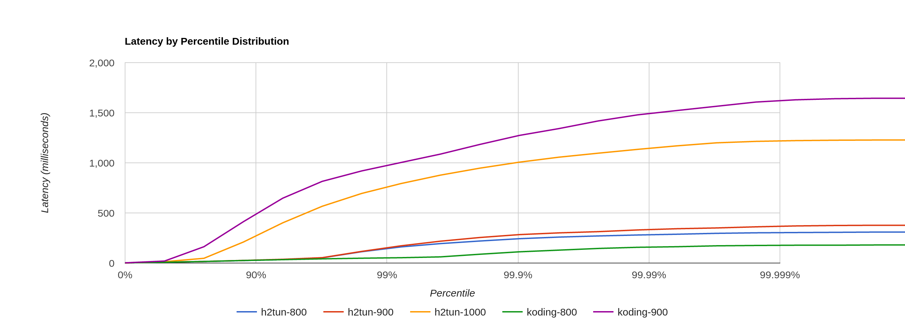
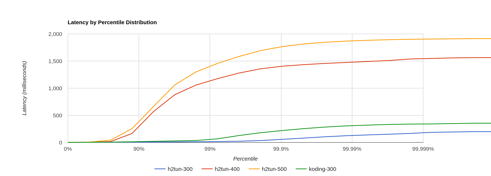

# Benchmark report

The benchmark compares h2tun to [koding tunnel](https://github.com/koding/tunnel) on serving 184 midsized files that were gathered by saving `amazon.com` for offline view. The data set consists of images and text data (js, css, html). On start client loads the files into memory and act as a file server.

## Environment

Tests were done on four AWS `t2.micro` instances. An instance for client, an instance for server and two instances for load generator. For load generation we used [vegeta](https://github.com/tsenart/vegeta) in distributed mode. Process open files limit was increased to `20000`.

## Load spike

This test compares performance on two minute load spikes.

h2tun handles 900 req/sec without dropping a message and preserving a good latency. At 1000 req/sec h2tun still works but drops 0,20% requests and latency is much worse.

Koding tunnel is faster at 800 req/sec, but then latency degrades giving maximum values of 1.65s at 900 req/sec and 23.50s at 1000 req/sec (with 5% error rate).

Detailed results of load spike test.

| Impl.  | Req/sec | Success rate | P99 (corrected)| Max            |
|-------:| -------:|-------------:| --------------:| --------------:|
| h2tun  | 600     | 100%         | 40.079103ms    | 147.310766ms   |
| h2tun  | 800     | 100%         | 161.093631ms   | 308.993573ms   |
| h2tun  | 900     | 100%         | 172.114943ms   | 376.924512ms   |
| h2tun  | 1000    | 99.90%       | 793.423871ms   | 1228.133135ms  |
| koding | 600     | 100%         | 43.161855ms    | 173.871604ms   |
| koding | 800     | 100%         | 53.311743ms    | 180.344454ms   |
| koding | 900     | 100%         | 1003.495423ms  | 1648.814589ms  |
| koding | 1000    | 94.95%       | 16081.551359ms | 23494.866864ms |

## Constant pressure

This test compares performance on twenty minutes constant pressure runs.

h2tun shows ability to trade latency for throughput. It runs just fine at 300 req/sec but at higher pace the bad things tend to aggregate resulting in increased latency or even message drops. 

Koding tunnel also runs well at 300 req/sec, however, with increased load it just breaks.

Both implementations have a connection (or memory) leak when dealing with too high loads. This results in process (or machine) crash as machine runs out of memory. It's 100% reproducible, when process crashes it has few hundred thousands go routines waiting on select in a connection and memory full of connection buffers. During the constant pressure tests it also happened that koding tunnel client crashed a (panic in yamux), that was never observed for h2tun.

Detailed results of constant pressure test.

| Impl.  | Req/sec | Success rate | P99 (corrected)| Max            |
|-------:| -------:|-------------:| --------------:| --------------:|
| h2tun  | 300     | 100%         | 16.614527ms    | 199.479958ms   |
| h2tun  | 400     | 99.98%       | 1175.904255    | 1568.012326ms  |
| h2tun  | 500     | 99.96%       | 1457.364991ms  | 1917.406792ms  |
| koding | 300     | 100%         | 66.436607ms    | 354.531247ms   |
| koding | 400     | 82.66%       | -              | -              |
| koding | 500     | 63.16%       | -              | -              |

